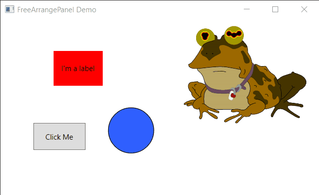
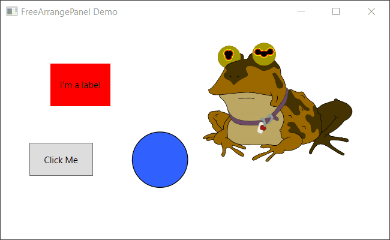
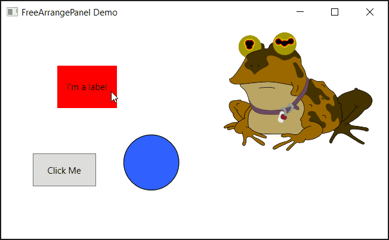

# FreeArrangePanel.WPF
WPF panel that allows the user to move and resizing of child controls at runtime. Has overlap control, can prevent user from overlapping one control with another. Supports selecting and moving multiple controls.

## Examples

In the following examples the label control and the ellipse control are overlappable. However, the button and the image controls are not, as you can notice from the GIFs below.

### Single control move demo:

### Select and move multiple demo:

### Resize from sides demo:

### Resize from corners demo:

## Project status:

Currently the project is on hold. There are plans to improve adorner (handle) rendering for rendering inside resize handles. However, the control is usable and the demo shows some of the available features. At some point in time, I hope to be able to update this library, add some docs and possibly port it to .NET 5 (.NET Core) with Avalonia UI support.